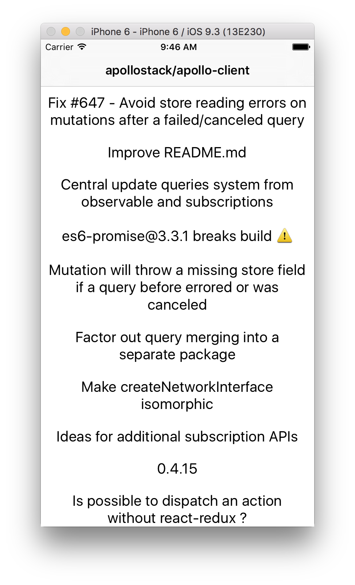
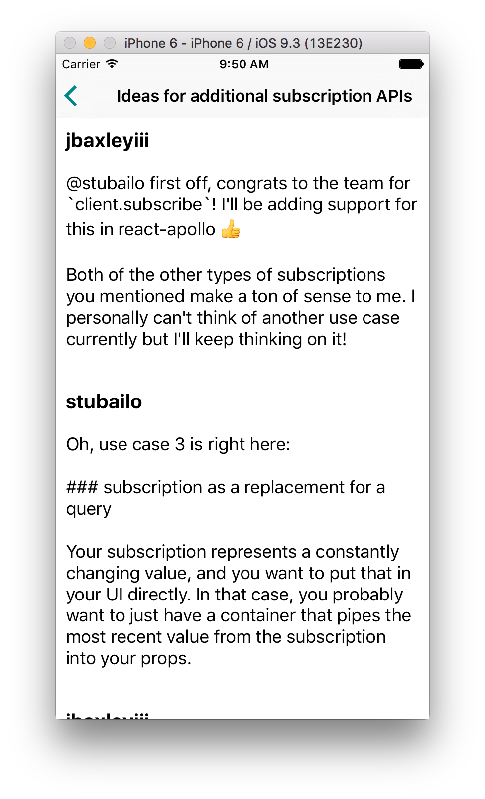

# IssueReader

On September 14, 2016, GitHub announced a preview of their new GraphQL API. [Read our recap of the news here!](https://medium.com/apollo-stack/the-new-github-graphql-api-811b005d1b6e#.jicbo4wzl).

This is a small app to demonstrate how to load and paginate some issues and comments from a repository, using [Apollo Client with React Native](http://dev.apollodata.com/react/).

Before getting started make sure you have registered to get access to the [GitHub pre-release program](https://github.com/prerelease/agreement).  

### Running

1. Copy `config.default.js` into a file called `config.js`, and replace `xxx` with your username and password
2. Install dependencies with `npm install`
3. Run 'npm run start' in terminal. For more, please check https://github.com/react-community/create-react-native-app.

### Current features

1. Sending a login token to GitHub API by attaching an `Authorization` header to the request
2. Navigating between two views and loading different queries, with caching built into Apollo Client
3. Infinite scroll pagination using the GraphQL connections

### Screenshot

The UI is pretty basic, with only the default styling. The first page is the list of issues for the Apollo Client repository, and if you tap you can see the comments for that issue on the second page. As you scroll down, the app eventually loads all of the issues and comments.

### Contributing

Help make the app better! Some ideas:

1. Add real login, ideally with OAuth
2. Add markdown rendering for comments
3. Add a mutation to add reactions to comments, or post a new comment
